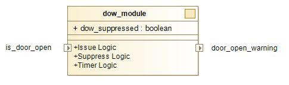

# Tutorial: Introduction

This first part of the tutorial is about why we have system requirements and how to write them in the declative specification languages. We will use [Reelay Expression Format](rye.md) to write our specifications. The following parts will about how to check these specifications over temporal data streams using **Reelay** monitors in [C++](gs_cpp.md) or [Python](gs_python.md).

Throught the tutorial, we use an example from the robotics such that we are designing a home assistant robot as our next big product. Besides we also think our customers would love our robots with a door open warning feature but it must be tested properly!

## An Example Feature

So we want to design a feature that warns the user whenever our system (robot) detects the entry door is left open. For the Door Open Warning (DOW) feature, there are two classes of failures, false positives (FP) and false negatives (FN). If we were more functional safety minded, there will be the assessment of the severity of each class but let's leave such aspects for another time. We will simply measure the progress of development by the number of failures over some set of test cases.

The next step is to analyse and break down the feature into (testable) system requirements. Perhaps we would want to issue a warning after some time, say 5 minutes, rather than immediately. This constitutes our first requirement expressed as follows:

!!! Requirement
    **SYS-REQ-01:** The system shall issue a warning if the entry door is left open at least 5 minutes.

An important point here is that we can actually check this requirement over the behavior of the robot in such scenarios. Perhaps a spoiler but we will use **Reelay** monitors to check but let's finish our requirements first. Assume that we also want to give the warning once as multiple warnings for the same occasion may annoy our users. This constitutes our second requirement expressed as follows:

!!! Requirement
    **SYS-REQ-02:** The door should be closed before the system issues another warning. This should prevent that the warning is issuing several warnings after another, while the door is open.

Now we have a set of system requirements for the DOW feature. And we may design a system whose block diagram given is below:



For example, a **discrete time behavior** of the system would be a sequence of observations (data) as follows: 

| time (mins) | door_open | dow_suppressed | door_open_warning |
|-------------|-----------|----------------|-------------------|
| 1 | False    | False | False |
| 2 | **True** | False | False |
| 3 | **True** | False | False |
| 4 | **True** | False | False |
| 5 | **True** | False | False |
| 6 | **True** | False | False |
| 7 | **True** | False | **True**  |
| 8 | **True** | **True**  | False |
| 9 | **True** | **True**  | False |
| ... | ...  | ...  | ... |

where our robot sample one data point per a fixed time unit. 

Alternatively, we could have designed an asynchronous (event-driven) architecture and emitted timestamped observations **at irregular intervals**, which we call **dense time behaviors**. Reelay uses the same specification to generate runtime monitors either for discrete or dense time behaviors.

Next sections will be about writing these requirements in Reelay Expression format, an unambigious and executable specification language.

## Specify Requirements

We will use Reelay Expression (RYE) format to specify our requirements. RYE format is a temporal logic based formal language, commonly used to describe temporal patterns over signals in a precise and unambigious manner. **Reelay** can compile RYE specifications into efficient runtime monitors.

Let's specify!

Our first requirement `SYS-REQ-01` says that the system shall issue a warning if the door is open at least 5 minutes. This of course should be under understood under a condition that the warning is not suppressed as `SYS-REQ-02` will require. This often goes without saying as humans can relate two requirements easily. However, when specifiying requirements for the machine, we have to be more explicit. Below is the first part of `SYS-REQ-01` expressed in RYE:

```rye
(historically[0:5]{door_open} and not {dow_suppressed}) -> {door_open_warning}
```

The implication operator `->` says the right hand side must be true if the left hand side is true. The temporal operator `historically[a:b]{cond}` tells that the condition `cond` must be always true between time points `[now-b, now-a]`. Therefore, the part `historically[0:5]{door_open}` is true if `door_open` is always true from `5` minutes ago to `now`. The reference for Reelay expression format is available [here](rye.md), which includes other temporal and Boolean operators. Overall this specification verifies `SYS-REQ-01` and its violation would be considered as a false negative.

In plain English, the conditional connective `if` has sometimes a bi-directional meaning where the reverse case also goes without saying. This is also the case for `SYS-REQ-01`. The remaining two specifications verify `SYS-REQ-01` in a reverse way, for false positives, respectively.

```rye
{door_open_warning} -> historically[0:5]{door_open}
```

```rye
{door_open_warning} -> not{dow_suppressed}
```

Finally, the second requirement `SYS-REQ-02` describes a behavior that involves slightly more complex temporal ordering of events. Here we see the use of temporal operators `pre` (meaning previously) and `since`.

```rye
{door_open_warning} -> not(pre({door_open} since {door_open_warning}))
```

This specification means that, whenever `door_open_warning` is true, `door_open` should `not` be continuously true `since` the last time `door_open_warning` is true. Therefore, the specification capture the intended meaning of `SYS-REQ-02` and its violation would be considered as a false positive.

To conclude, let's tabulate our formal specifications obtained from system requirements above in a table nicely as follows:

| Requirement  | Specification                                                                | Failure Type   |
|--------------|------------------------------------------------------------------------------|----------------|
| `SYS-REQ-01` | `(historically[0:5]{door_open} and not {dow_suppressed}) -> door_open_warning` | False Negative |
| `SYS-REQ-01` | `{door_open_warning} -> historically[0:5]{door_open}`                          | False Positive |
| `SYS-REQ-01` | `{door_open_warning} -> not{dow_suppressed}`                                    | False Positive |
| `SYS-REQ-02` | `{door_open_warning} -> not(pre({door_open} since {door_open_warning}))`           | False Positive |

## Check Requirements

 **Reelay** has been designed for flexibility and efficiency in mind so that users can embed runtime specification monitoring for their projects in C++ or Python. Following tutorials will explain how to check these specifications over the system behavior.

* [Check requirements in C++](gs_cpp.md)
* [Check requirements in Python](gs_python.md)
